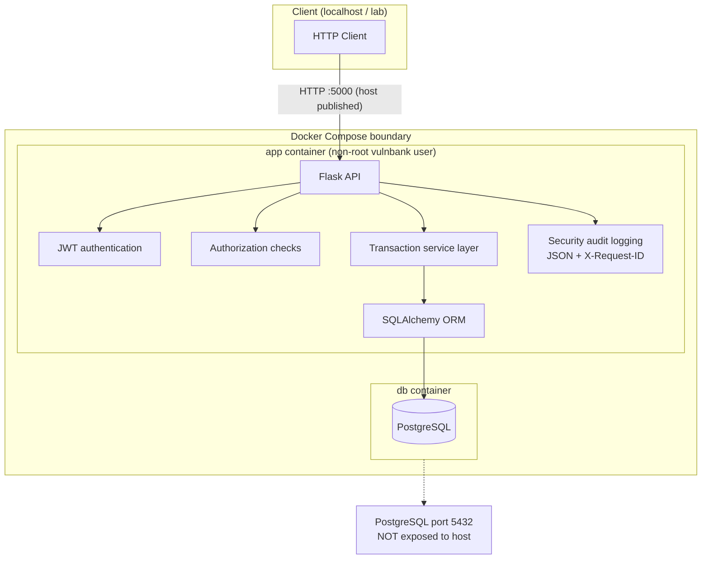
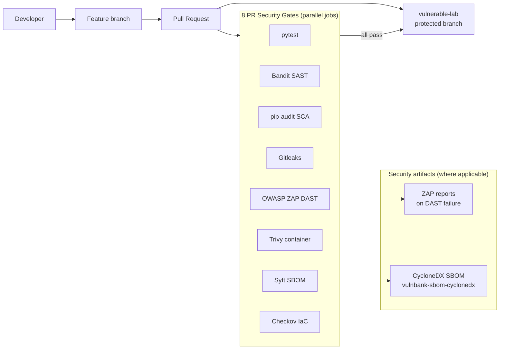

# Security Architecture

Architecture views for VulnBank on **`vulnerable-lab`**: runtime application stack and DevSecOps pipeline.

## Runtime architecture

VulnBank is a Flask REST API with JWT authentication, a service layer for transfers, SQLAlchemy ORM, and PostgreSQL. Security audit events and request correlation IDs are emitted from the application layer.

### Runtime security properties

| Property | Implementation |
|----------|----------------|
| Authentication | JWT (`Authorization: Bearer`) on protected routes |
| Authorization | Object-level checks (accounts, transactions, users) |
| Financial integrity | DB transactions, row locking, Decimal types |
| Secrets | `JWT_SECRET_KEY`, `DATABASE_URL` via environment - not in Git |
| Audit trail | `vulnbank.security` JSON logger; no passwords/JWTs in logs |
| Request tracing | `X-Request-ID` (client or server UUID) |
| Database exposure | Internal Compose network only |
| Container identity | `USER vulnbank` in Dockerfile |

See [security-logging.md](security-logging.md), [container-security.md](container-security.md), [deployment-security.md](deployment-security.md).

## DevSecOps pipeline architecture

Changes flow through feature branches and pull requests into the protected **`vulnerable-lab`** branch after eight required security gates pass.

### Gate summary

| # | Job name | Tool | Primary focus |
|---|----------|------|---------------|
| 1 | PR Security Gate - Test Suite (pytest) | pytest | Functional + security regression (125 tests) |
| 2 | PR Security Gate - SAST (Bandit) | Bandit | Python source anti-patterns |
| 3 | PR Security Gate - SCA (pip-audit) | pip-audit | Declared dependency CVEs |
| 4 | PR Security Gate - Secret Scan (Gitleaks) | Gitleaks v3 | Git history secrets |
| 5 | PR Security Gate - DAST (OWASP ZAP) | OWASP ZAP | Passive baseline + authenticated regression |
| 6 | PR Security Gate - Container Scan (Trivy) | Trivy | Fixable HIGH/CRITICAL image CVEs |
| 7 | PR Security Gate - SBOM (Syft) | Syft | CycloneDX JSON from **built image** |
| 8 | PR Security Gate - IaC Scan (Checkov) | Checkov | Dockerfile + Compose configuration |

Pipeline hardening: SHA-pinned actions, workflow `contents: read`, concurrency cancellation, job timeouts - see [cicd-security.md](cicd-security.md).

Workflow definition: [`.github/workflows/security.yml`](../.github/workflows/security.yml).

## Related documentation

- [threat-model.md](threat-model.md)
- [security-journey.md](security-journey.md)
- [supply-chain-security.md](supply-chain-security.md)
